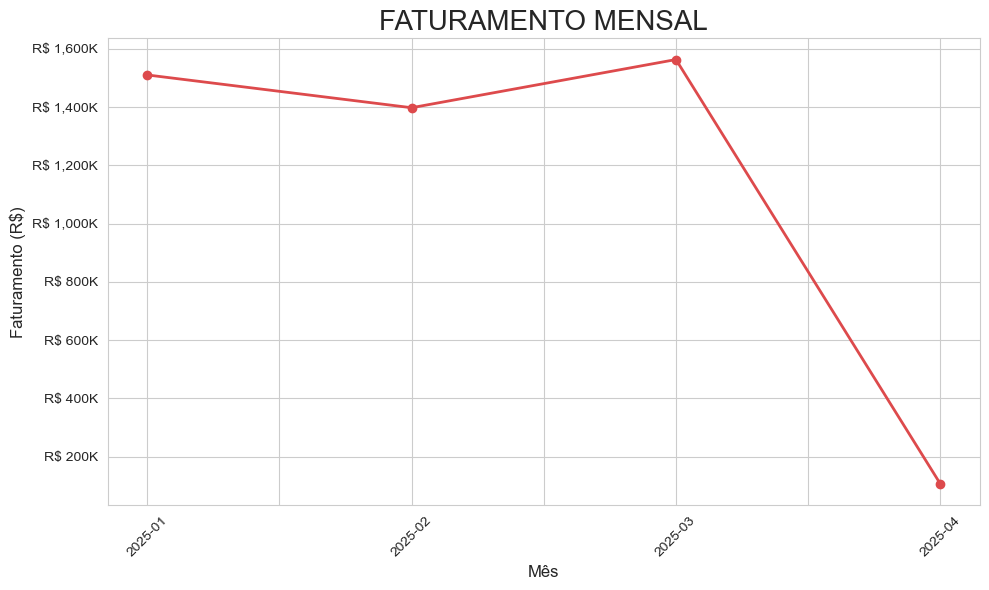
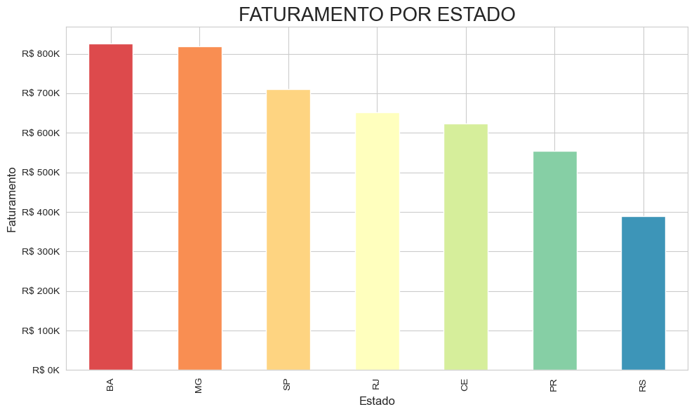
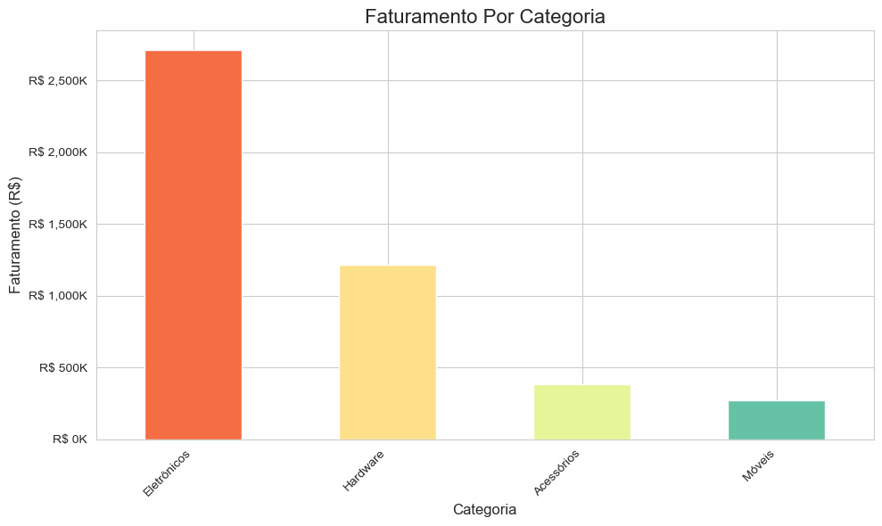
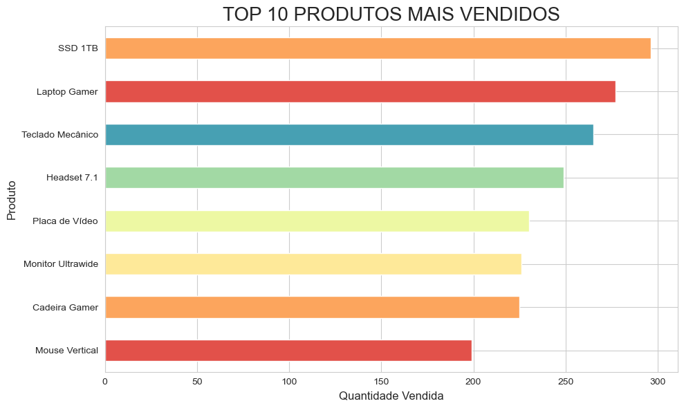

# Análise de Vendas para E-commerce com Pandas, Numpy e Matplotlib

Este projeto foi desenvolvido como parte do curso de Fundamentos de Linguagem Python para Análise de Dados e Data Science da Data Science Academy (DSA).

## Definicao do Problema
O objetivo central deste trabalho é transformar dados brutos de transações de uma loja de e-commerce em informações estratégicas. A análise aborda a falta de visibilidade sobre a performance do negócio, auxiliando na transição de decisões baseadas em intuição para decisões baseadas em evidências e dados reais.

## Objetivo do projeto
* Identificar quais produtos possuem melhor desempenho de vendas;
* Determinar quais categorias geram maior faturamento;
* Analisar o comportamento das vendas ao longo do tempo, identificando tendências e sazonalidades;
* Mapear as regiões com maior volume de vendas e potencial de crescimento.

## Tecnologias Utilizadas
O projeto utiliza o ecossistema Python para análise de dados, especificamente as bibliotecas:
* **pandas:** para manipulação e análise de dados em formato tabular;
* **numpy:** para operações numéricas e matemáticas;
* **matplotlib:** para criação de gráficos e visualizações;
* **seaborn:** para visualizações estatísticas mais elaboradas;
* **random:** para geração de valores aleatórios.

## Competências Consolidadas
Com base na estrutura do projeto, foram aplicadas as seguintes técnicas:
* Manipulação e Higienização de Dados;
* Engenharia de Atributos para criação de novas variáveis;
* Análise Estatística e Exploratória;
* Data Storytelling e Visualização Gráfica;
* Interpretação de Resultados Estratégicos (KPIs de e-commerce).

## Resultados e visualizações

## Resultados e Insights
A análise permitiu:
* Identificação dos produtos mais e menos vendidos;
* Compreensão das categorias mais lucrativas;
* Visualização do comportamento das vendas ao longo do tempo;
* Identificação das regiões com maior potencial de mercado;
* Tomada de decisões estratégicas baseada em dados.
